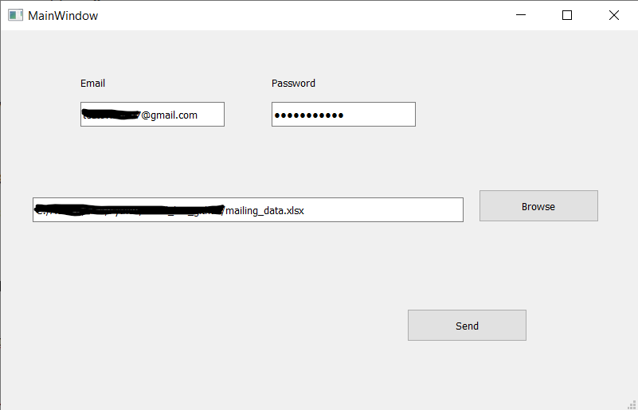
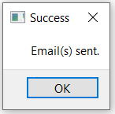

# Email-bot
## Specification
The bot is designed to send customers an e-mail asking them to complete surveys, but it can easily be transformed in order to provide different functionalities.
In this version of the code each client has an individual and unique link to the survey. Client's sex, name, surname, email adress and the link to the survey should be prepared in an .xlsx file. The data should have at least the fields shown in the file **mailing_data.xlsx**. Fields must have the same names but they don't need to be in the same order, and there can be some additional fields.
## Email account settings
In order to use the Gmail account to do the sendout it is necessary to lower the security standards of the account from which we want to send emails.
It can be easily done anther the below link:\
\
https://myaccount.google.com/lesssecureapps?pli=1&rapt=AEjHL4OeS38IxTCTmc4d9QMYF4nuAGSxJoNMsNao3qimP6b30LkoC7k32aOa7RMjZPbzF1AkB89ogSd5mHGyGfBSNHBfvzxcvQ \
\
You just need to click enable **Access for less secure applications**.
Unfortunately it is necessary, because most of the email services protect themselves against not authorised programs. Possibly the solution could be connection encryption, but I haven't checked that yet.
## Configuration
The files required for the program to run are:
- **mailing_bot.py** call file
- gender-specific message content in **message_f.txt**, **message_m.txt** files (content can be changed but the name of the files must remain the same)
- signature in **signature.txt** (content can be changed but the name of the files must remain the same)
- file in the .xlsx format containing the addressees' data and links in the above-mentioned layout (name of the file can be changed)
\
\
Four first filles: **mailing_bot.py**, **message_f.txt**, **message_m.txt**, **signature.txt**, should be put into the same folder, preferably empty one.
## Functionality
1. Change email settings as it was explained in the section **Email account settings**.
2. Download the files: **mailing_bot.py**, **message_f.txt**, **message_m.txt**, **signature.txt** and place them in a one folder.
3. Adjust the text in the files: **message_f.txt**, **message_m.txt**, **signature.txt** to your needs. Don't change the name of them!
4. To start the program it is necessary to have python interpreter. If you don't have one you can download one for example from that link:
\
https://code.visualstudio.com/docs/python/python-tutorial

3. Open **mailing_bot.py** file with VSC or other python interpreter.
4. Start the program by clicking "Run" or "Ctrl+F5".
5. When the dialog box appears, enter your email address and password, and enter the path to the file with recipient data and survey links. This can be done via the "Browse" button.

7. Confirm using the "Send" button.
8. If the sendout is successful, you should see the popup with a confirmation.
9. 
