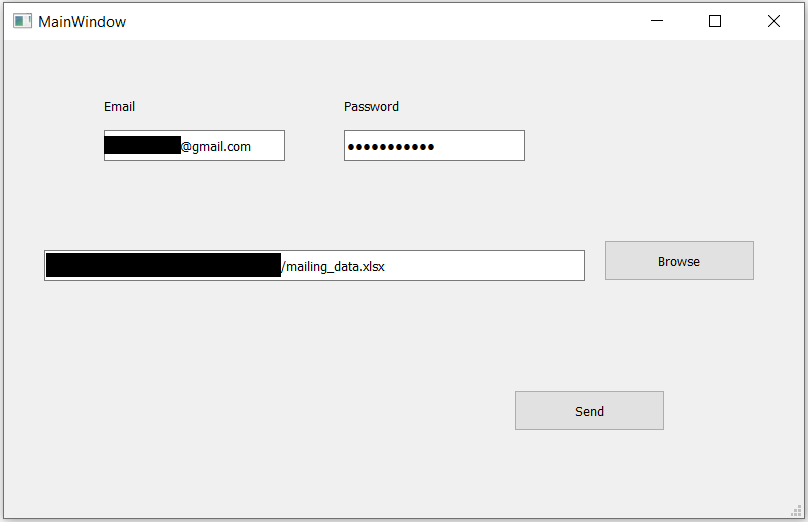

# Email-bot
## Specification
The bot is designed to send customers an emails asking them to complete surveys, but it can easily be transformed in order to provide different functionalities.
In this version of the code each client has a unique link to the survey. Each client's sex, name, surname, email adress and the link to the survey should be prepared in an .xlsx, .xls or .csv file. The data should include at least the fields shown in the file **mailing_data.xlsx**. Columns must have the same names but they don't need to be in the same order, and there can be some additional columns.
## Email account settings
In order to use a Gmail account use as the sender’s address it is necessary to lower the security standards of the account from which we wish to send the emails.
It can be easily done under the link below:\
\
https://myaccount.google.com/lesssecureapps?pli=1&rapt=AEjHL4OeS38IxTCTmc4d9QMYF4nuAGSxJoNMsNao3qimP6b30LkoC7k32aOa7RMjZPbzF1AkB89ogSd5mHGyGfBSNHBfvzxcvQ \
\
You just need to click **enable access for less secure applications**.
Unfortunately it is necessary, because most of the email services protect themselves from unauthorised programs. A possible solution could be encrypting the connection, but it was not implemented nor verified.
## Configuration
The files required for the program to run are:
- **mailing_bot.py** program file
- gender-specific message content in **message_f.txt**, **message_m.txt** files (content can be changed but the names of the files must remain the same)
- signature in **signature.txt** (content can be changed but the name of the file must remain the same)
- file in the .xlsx, .xls or .csv format containing the addressees' data and links in the above-mentioned layout (name of the is not relevant)
\
\
First four files: **mailing_bot.py**, **message_f.txt**, **message_m.txt**, **signature.txt**, should be put into the same folder, preferably an empty one.
## Functionality
1. Change email settings as it was explained in the section **Email account settings**.
2. Clone the repository and place the contents in one folder.
3. Adjust the text in the files: **message_f.txt**, **message_m.txt**, **signature.txt** to your needs. Don't change their names!
4. To start the program it is necessary to have a python interpreter. If you don't have one you can download it for example from that link:
\
https://code.visualstudio.com/docs/python/python-tutorial

3. Open the **mailing_bot.py** file with VSC or any other python interpreter.
4. Start the program by clicking "Run" or "Ctrl+F5".
5. When the dialog box appears, enter your email address and password, and enter the path to the file the with recipients' data and survey links. This can be done via the "Browse" button.

7. Confirm by pressing the "Send" button.
8. If the mailing is successful, you should see a popup with a confirmation.
\
\

